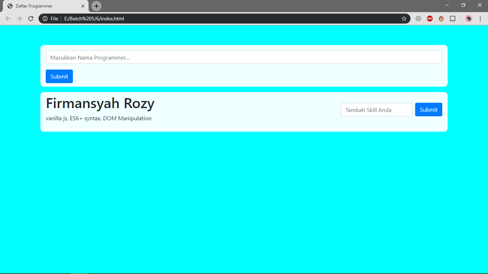
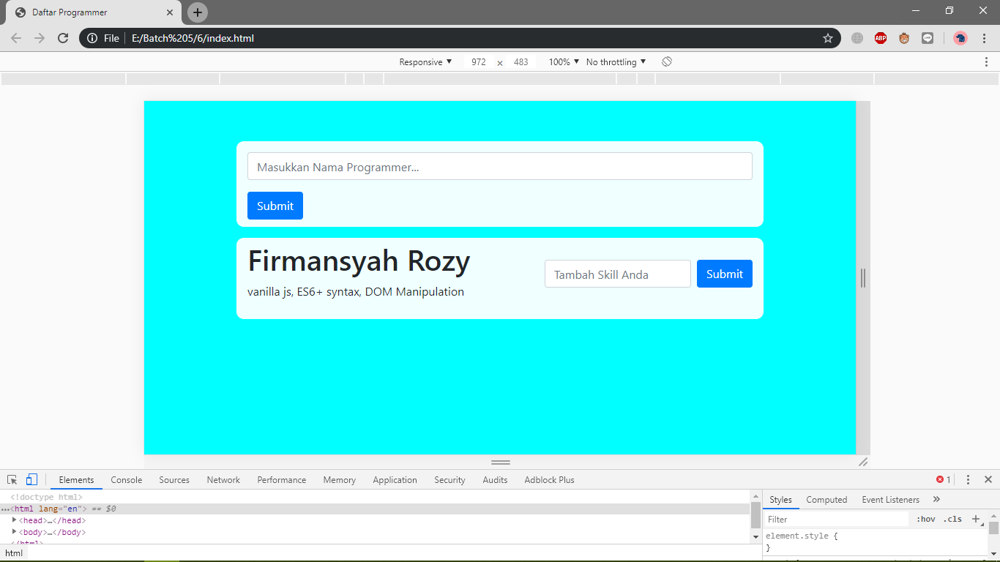
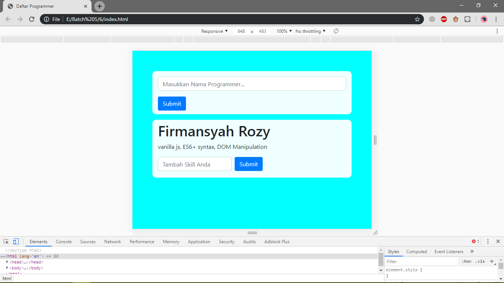
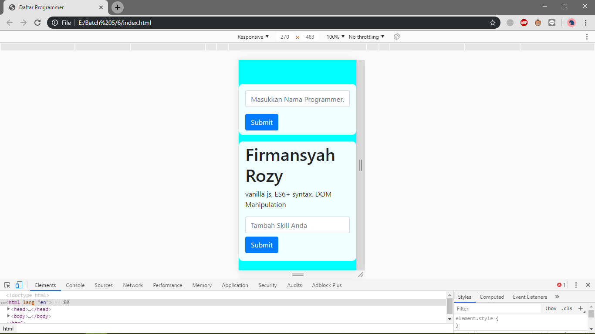

# FIRMANSYAH ROZY

## Soal No. 1
---
 - **_REST API_** adalah suatu gaya arsitektural yang didalamnya terdapat aturan-aturan tertentu untuk membuat layanan web.
 - Kegunaan _JSON_ pada _REST API_ adalah format data yang dihasilkan dari sebuah _API_ yang nantinya data _JSON_ tersebut dikonsumsi oleh si pengguna _API_.
   
---

## Soal No. 2 - 5
---
  - Kode bisa dijalankan di javascript console
---

## Soal No. 6

---

  

  

  

  

  

  
  
  
  
  
  
  
  
---

  
        
